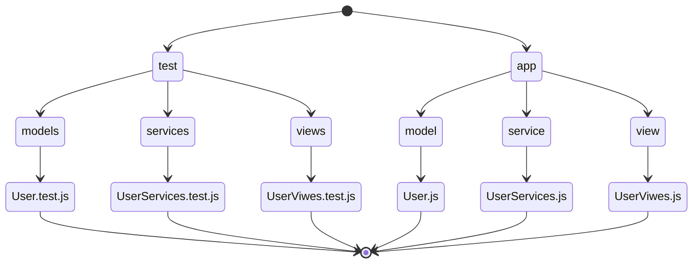

# Proyecto 3 Twitter

Semana 3 en LaunchX. Este proyecto contendrá el proyecto 3, 4 y 5.

## Estructura del proyecto

- Cada archivo contiene sus TDD correspondientes 

## Dependencias 
[Jest](jestjs.io/)
